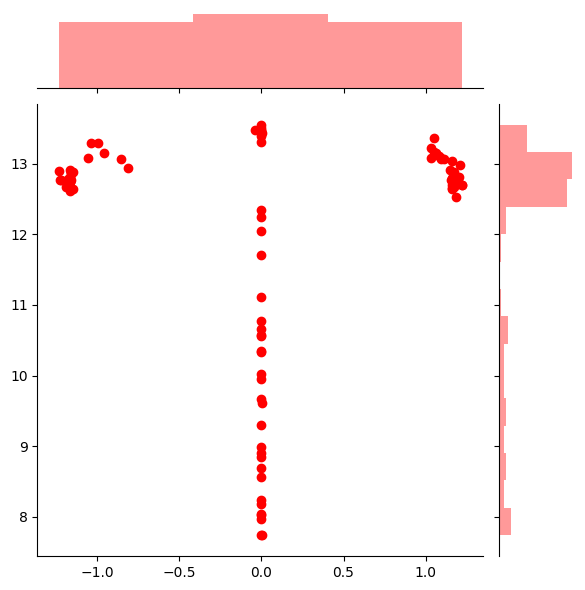
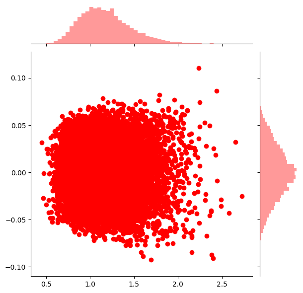

## Resample in 3-layer NN

- network architecture:
- $x \in \mathbb{R}$, $h_1 \in \mathbb{R}^{n_1}$ and $h_2 \in \mathbb{R}^{n_2}$: $n_1=100, n_2=10000$, 
- assume $\lambda_3 >> \lambda_2 >> \lambda_1$
- step1: could learn a concentrated distribution of $u$ and $\theta_2$
	- continuous version: $\theta_1 \in \mathbb{R}$, $\theta_2 \in L^2(\mathbb{R})$
		- define $\omega_1(\theta_1)=\sqrt{\int |\theta_2(\theta_1)|^2 \mu(d\theta_2)}$, we should have $\text{Var}_{\mu(\theta_1)}(\omega_1) \approx 0$
		- define $\omega_2(\theta_2)=\int u \mu(d\theta_2, du)$, we should have $\text{Var}_{\mu(\theta_2)}(|\omega_2|) \approx 0$
	- discrete version: $W_1 \in \mathbb{R}^{n_1 \times 1}$, $W_2 \in \mathbb{R}^{n_2\times n_1}$, $W_3 \in \mathbb{R}^{1\times n_2}$
		- we could witness that the variances of the norm of different columns of $W_2$ and $W_1$ are near zero.
	- experiment results:
		- [1] the variance of $\omega_1(\theta_1)$ increases (when $\theta_1 \approx 0$, $\omega_1(\theta_1)$ varies: x is $theta_1$, y is $\omega_1(\theta_1)$)
		
		- [2] $\omega_2(\theta_2)$ doesn't concentrate (x is $\|\theta_2\|_2$, y is $\omega_2(\theta_2)$):
		 
	- other results:
		- I found the problem of [2] is originated from the facts that the batch norm in layer 2 is not effective.
			- std of each neuron in layer 1 is ranged from [0.64, 1.44]: 1.03 +/- 0.09
			- std of each neuron in layer 2 is ranged from [0.067, 3.919]: 1.04 +/- 0.32
			- when I conduct experiments in 2-layer nn, it is about 1.0 +/- 0.01